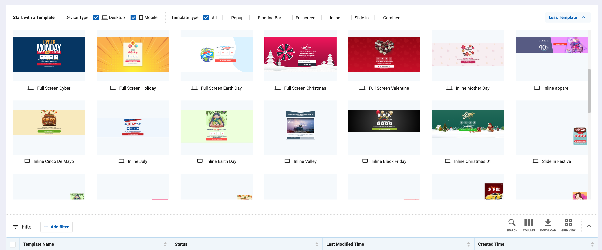

# Media Template

Show template on mobile

Its supports template:
- POP_UP
- FLOATING_BAR
- FULL_SCREEN
- INLINE
- SLIDE_IN
- GAMIFIED


[Media Template](https://media-template.antsomi.com/)

## Getting Started
For help getting started with Flutter, view online documentation(https://flutter.dev/).

### iOS
In order for plugin to work correctly, you need to add new key to ios/Runner/Info.plist

```
<key>NSAppTransportSecurity</key>
<dict>
    <key>NSAllowsArbitraryLoads</key>
    <true/>
    <key>NSAllowsArbitraryLoadsInWebContent</key>
    <true/>
</dict>
```
NSAllowsArbitraryLoadsInWebContent is for iOS 10+ and NSAllowsArbitraryLoads for iOS 9.

## Intstall
```sh
flutter pub add mediatemplate
```

## Example
```dart
import 'package:flutter/foundation.dart';
import 'package:flutter/material.dart';
import 'package:mediatemplate/mediatemplate.dart';
import 'package:flutter/scheduler.dart';

class FloatingBar extends StatefulWidget {
  const FloatingBar({Key? key}) : super(key: key);

  @override
  State<FloatingBar> createState() => _FloatingBarState();
}

class _FloatingBarState extends State<FloatingBar> {
  late AdInfo _ad;
  bool loaded = false;

  void initState() {
    Ads.load(
        portalId: 561236459,
        propsId: 564990801,
        zoneCode: 'floating_bar',
        userId: '123-23992-23991-2132',
        onAdFailedToLoad: (String error) {
          print(error);
        },
        onAdLoaded: (AdInfo ad) {
          setState(() {
            _ad = ad;
            loaded = true;
          });
        });
  }

  @override
  Widget build(BuildContext context) {
    final scaffoldKey = GlobalKey<ScaffoldState>();

    if (loaded) {
      WidgetsBinding.instance.addPostFrameCallback((_) {
        Ads.show(_ad, context, scaffoldKey);
      });
    }

    return Scaffold(
        key: scaffoldKey,
        appBar: AppBar(
          title: const Text('FloatingBar'),
        ),
        body: Center(
          child: ElevatedButton(
            child: const Text('Home'),
            onPressed: () {
              // Navigate to home route when tapped.
              Navigator.pop(context);
            },
          ),
        ));
  }
}

```


## Usage
- Open example to get more information